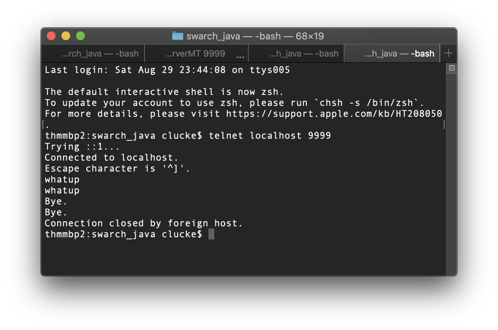

# VL SW-Arch
Dieses Projekt enthält den Quellcode für die Java-basierten Übungen in der Veranstaltung "SW-Architektur". Das Projekt wurde in IntelliJ entwickelt.

Das Projekt enthält eine Docker-Konfiguration (`Dockerfile`). Falls Sie auf Ihrem Rechner ein Java-SDK installiert haben, dann benötigen Sie den Container nicht. Sie können Ihn aber trotzdem benutzen.

Die vorhandenen Module sind:

- swarch-sockets

## Allgemeine Hinweise
Teilweise müssen Sie Quellcode komplett neu schreiben, teilweise gibt es aber auch schon vorhandene Klassen und Interfaces, welche Sie anpassen sollen. Im letzteren Fall sind i.d.R. Stellen im Code mit TODO-Markern versehen. Hier sollen Sie Änderungen vornehmen. Es gibt einen View „TODO“, wo solche zu erledigende Aufgaben angezeigt werden. Sie finden die Ansicht im unteren Bereich von IntelliJ. Sollte diese nicht angezeigt sein, können Sie sie über den Shortcut `ALT + 6` oder über das Menü einblenden.


## Übung zur Socket-Programmierung

Ziel der Übung ist die Erstellung eines Echo-Servers und eines dazugehörigen Clients auf Basis von Sockets programmiert mit der Java Socket-API.

Die grundlegende Funktionsweise ist im Rahmen der Vorlesung besprochen worden. Das Serverprogramm wird an einen TCP-Port des Rechners gebunden (Hostname und Port machen einen „Endpoint“ aus) und wartet auf eingehende Verbindungen. Stellt ein Client eine Verbindungsanfrage wird eine Verbindung aufgebaut – man spricht von einer Endpoint-Connection. Über diese Endpoint-Connection können sodann Daten übertragen werden. Der EchoServer liest jeweils eine Zeile des Clients und sendet die identische Zeichenfolge an diesen zurück – das Echo.

Lesen Sie die Informationen unter [SP.1] und programmieren Sie zunächst den Serverteil des Socket-Servers. Das Vorgehen wird auf der Website beschrieben.
Wenn Sie den Server programmiert und gestartet haben, dann können Sie diesen testen. Starten Sie ein Terminal und verbinden Sie sich mittels `telnet` mit dem Server-Endpoint (siehe folgende Abbildung).





**Optional:** Wenn lokal alles funktioniert, stimmen Sie sich mit einem Kommilitonen ab und stellen eine Remote-Verbindung von einem anderen Rechner mit Ihrem Echo-Server her.

### Docker-Kommandos
Voraussetzung ist, dass Sie Docker lokal auf Ihrem Rechner installiert haben.

- Docker-Container bauen: `$ docker build -t swarch_java .`
- Docker-Container starten und auszuführende Java-Klasse (Echo-Server) angeben: `$ docker run -it -p 9999:9999 swarch_java de/thm/swarch/sockets/echoserver/EchoServer 9999`, startet den EchoServer auf Port `9999` und macht den Container-Port auf dem Host verfügbar
- EchoClient starten: `$ docker run -it swarch_java de/thm/swarch/sockets/echoclient/EchoClient host.docker.internal 9999`. Der Client darf sich nicht zu `localhost`verbinden, da dies der Docker-Container ist. Der Server, wenn wie oben angegeben gestartet, bindet das Socket aber an den Host-Rechner, nicht im Container. Der Hostname, um aus einem Container an den Hostrechner zu verbinden, ist `host.docker.internal`.
- Terminal im laufenden Docker-Container starten: `$ docker exec -it <CONTAINER-ID> /bin/bash`
- Docker-Prozesse anzeigen: `$ docker ps`, um die Container-ID zu identifizieren


### Mehrere Clients ...
Wenn Sie sich an das Beispiel der oben genannten URL gehalten haben, werden Sie feststellen, dass Ihr Echo-Server nur jeweils eine Client-Verbindung verarbeiten kann.
Das ServerSocket ist grundsätzlich in der Lage mehrere EndpointConnections anzunehmen. Die eingehenden Verbindungsanfragen werden nacheinander verarbeitet. Bei zwei oder mehr Verbindungsanfragen, muss die Verbindungsannahme und die Kommunikationsverarbeitung mit dem Client auf Threads übertragen werden. D.h. es gibt einen Serverprozess, welcher auf eingehende Verbindungen horcht und je Client einen Thread, der durch Verbindungsannahme die Referenz auf ein Socket erhält und sich um die Abwicklung der eigentlichen Kommunikation kümmert. Wie dies implementiert wird, ist unter [SP.2] im Abschnitt „Supporting Multiple Clients“ beschrieben. Versuchen Sie Ihr Glück!
Wenn alles korrekt implementiert ist, kann Ihr Echo-Server nun eine Vielzahl von Clients gleichzeitig bedienen. Testen Sie dies erneut mittels telnet.

### Lang-laufende Anfragen
Die Anfragen an den Echo-Server werden synchron bearbeitet. Das bedeutet, dass der Client auf eine Antwort des Servers wartet, auch wenn dies sehr lang dauert. Währenddessen ist der Client blockiert.

Um dies zu simulieren können Sie mit Thread.sleep(2000) die Abarbeitung im Echo-Server verzögern, sodass der Client etwas auf das Echo warten muss.
Über synchrone und asynchrone Kommunikationsmodelle werden wir im weiteren Verlauf der Vorlesung noch sprechen.

### Zusatzaufgabe
Programmieren Sie optional einen Echo-Client als Java-Applikation für die Kommandozeile.

### Quellen zur Aufgabe
- **[SP.1]** ,https://docs.oracle.com/javase/tutorial/networking/sockets/index.html
- **[SP.2]** https://docs.oracle.com/javase/tutorial/networking/sockets/clientServer.html


## Übung: Web Service mit Java (JAX-WS und PHP)

Ziel der Übung ist die Implementierung eines Web Services. Es soll ein einfacher Hallo-Welt Service programmiert und bereitgestellt werden, der nur einen einfachen String (`„Hallo Welt“`) als Resultat liefert.

### Der Serverteil des Hallo-Welt Web Service

Die Java API for XML Web Services (JAX-WS) dient zur Programmierung von SOAP-basierten Web Services in Java (siehe [WS.1]). Zunächst wollen wir den Serverteil entwickeln, der auch unter [WS.2] demonstriert wird. Den Code-Rumpf hierzu finden Sie in IntelliJ im Modul esi-ws.
Die Klasse `de.thm.swarch.ws.helloworld.service.HelloService` soll als Web Service exponiert werden. Der Service soll eine Methode `sayHelloWorldFrom`anbieten, die einen Namen als Parameter (Typ `String`) akzeptiert. Machen Sie Gebrauch von den notwendigen Annotationen.

Die Implementierung eines Interfaces ist nicht zwingend nötig, Sie können jedoch davon Gebrauch machen. Falls die konkrete Service-Implementierung öffentliche Methoden haben soll, die das Interface nicht definiert, ist das auf diese Weise möglich, nicht aber bei Verzicht auf ein Interface.

Wenn Sie die TODOs erledigt haben, ist die Implementierung des Web Service bereits abgeschlossen! Laut JavaEE Tutorial würde die Bereitstellung des Service wie folgt passieren:
 - Code the implementation class.
 - Compile the implementation class.
 - Package the files into a WAR file.
 - Deploy the WAR file. The web service artifacts, which are used to communicate with clients, are generated by GlassFish Server during deployment.

Da wir keinen ernsthaften Produktiveinsatz planen, genügt uns ein einfacher, programmatisch erstellter Endpoint, den wir aus der IDE heraus starten können. Die Klasse `HelloStarter` im gleichen Package kann dies wie folgt bewerkstelligen (schematisch):
````
String url = "http://<HOSTNAME>:<PORT>/<SERVICENAME>";
Endpoint.publish(url, new ServiceImpl());
````

Wenn Sie die Klasse korrekt annotiert haben, können Sie nun im Browser unter `http://<HOSTNAME>:<PORT>/<SERVICENAME>?wsdl` die WSDL-Datei aufrufen.

Um herauszufinden, ob der Service wie gewünscht funktioniert, können Sie SOAP-UI (bitte installieren, https://www.soapui.org/) oder ein beliebiges ähnliches Testprogramm verwenden.

Das Programm dient zum einfachen Test von Web Services. Mit STRG + N erzeugen Sie ein neues SOAP-Projekt. Sie können einen Projektnamen und die URL einer WSDL-Datei angeben. Setzen Sie den Haken bei `„Create Requests“` (per Default gesetzt), um SOAP-UI für jede Methode des Service einen Request erzeugen zu lassen. Die Informationen dazu liest SOAP-UI aus der WSDL-Definition des Service.

In der Baumstruktur auf der linken Seite sollten Sie nun einen `sayHelloWorldFrom`-Eintrag finden. Dies ist der von SOAP-UI erzeugte Request für den entfernten Aufruf dieser Methode des Web Service, den Sie in IntelliJ implementiert und über den Starter als Endpoint bereitgestellt haben.

Klicken Sie doppelt auf den Request und geben Sie im sich öffnenden Fenster einen Wert für den Parameter der Methode ein:
`<arg0>IHR WERT HIER</arg0>`.

Klicken Sie auf das grüne Play-Symbol und sehen Sie das vom Web Service übermittelte SOAP-Dokument. Voila, Sie haben Ihren Web Service fertig implementiert.

### Kommunikation in heterogenen Umgebungen

Im Rahmen der Vorlesung ist angesprochen worden, dass Web Services eine Kommunikationsform in verteilten Systemen darstellen, die besonders in sehr heterogenen Umgebungen von Vorteil ist. Ein Web Service, der in Java programmiert ist, kann problemlos auch von Client in anderen Programmiersprachen genutzt werden.

Unter der URL https://github.com/carstenlucke/swarch_php finden Sie ein git Repository mit in PHP programmierten Clients für den eben entwickelten Web Service.

Wenn Sie sich im Projektverzeichnis (i.e., `swarch_php`) befinden, können Sie mittels `$ docker-compose up --build` die Dockercontainer für Webserver und PHP starten. Nach erfolgreichem Start können Sie im Browser die URL `http://localhost`aufrufen und den Links zum PHP-WS-Client für den Hello-Service folgen.

Sie sollten eine Ausgabe ähnlich der Folgenden sehen:
````
object(stdClass)#2 (1) {
  ["return"]=>
  string(26) "Hello, world, from ESI in PHP-Skript"
}
````

Glückwunsch! Sie haben soeben aus einem PHP-Client heraus Ihren in Java programmierten Web Service aufgerufen.

### Komplexe Typen in Web Services

Der Hallo-Welt Service ist sehr einfach in seiner Art. Er stellt eine Methode bereits, die einen String als Parameter annimmt und einen String als Rückgabewert liefert. Von komplexen Typen haben wir bisher keinen Gebrauch gemacht und das wird sich jetzt ändern.

In das Package `de.thm.swarch.ws.customerservice` soll nun ein Web Service programmiert werden, der Inhalte aus einer Kundendatenbank zurück liefert. Dazu stellt der Service eine Methode bereit, welche ein Array von `de.thm.swarch.ws.customerservice.dao.Customer` Objekten liefert.

Dieses Datenobjekt verfügt über eine Menge von einfachen Attributen sowie die Angabe des Geschlechts, welches in der Enum-Klasse `Gender` im selben Package implementiert ist.

Wir verwenden statt einer echten Datenbank einfach die Klasse `de.thm.swarch.ws.customerservice.database.CustomerDatabase`, die eine statisch implementierte Menge von Datenobjekten erstellt / zurückgibt.

Die Service-Klasse `de.thm.swarch.ws.customerservice.service.CustomerService` soll eine Methode `public List<Customer> getCustomers()` implementieren und Kundendaten den aufrufenden Clients als Ergebnis übermitteln.

Wenn Sie die Implementierung abgeschlossen haben, können Sie die den Service, wie zuvor schon, über einen programmatisch erstellten `Endpoint` starten. Testen Sie mittels SOAP-UI und/oder mit Hilfe des entsprechenden PHP-Clients , ob Ihr Service funktioniert und ein sinnvolles Ergebnis liefert.

### Programmierung eines Web Service Clients in Java (optional)

Nachdem Sie nun die Implementierung der Web Services abgeschlossen und diese mittels SOAP-UI getestet haben, ist es an der Zeit, die Clients in Java zu implementieren.

In einem „Real-life“-Setting sind Anbieter und Nutzer eines Web Service i.d.R. nicht die gleiche Person. Im Normalfall finden Sie eine Dokumentation des Web Service vor und bestenfalls auch eine Anleitung zur Nutzung. Im Falle von SOAP-basierten Web Services hilft Ihnen das WSDL-File, um alle notwendigen Artefakte zu erzeugen.

**Variante 1:** Die Anleitung unter [WS.2] zeigt unterschiedliche Varianten zur Implementierung eines Web Service Clients in Java. Die erste Variante erzeugt die notwendigen Objekte on-the-fly. Es bedarf nur einer Klasse und ein paar Zeilen Code in der `main`-Methode.

**Variante 2:** Java bringt ein Kommandozeilenwerkzeug namens `wsimport` mit. Damit können auf Basis des WSDL-Files `.class` Dateien (und bei Bedarf auch Quelldateien dazu) erzeugt werden, die als Stub zum Aufruf des Service dienen.

Gehen Sie in das Verzeichnis, wo die Stubs von `wsimport` erzeugt werden sollen. Rufen Sie dort folgenden Befehl auf:
`$ wsimport -keep http://<HOSTNAME>:<PORT>/<SERVICENAME>?wsdl`.

Wenn Sie die Java-Klassen über `wsimport` generiert haben, dann sehen Sie sich den Quellcode zum Aufruf des Service an. Das Stub-Konzept wird Ihnen mittlerweile bekannt vorkommen. Interessant ist auch ein Blick in die generierten Klassen.

Die Übung ist damit abgeschlossen. Sie können wiederum testen, dass sich Ihre Services von Ihren Kommilitonen mit deren Clients aufrufen lassen. Dazu müssen Sie in den `Endpoint`-Starter Klassen lediglich die Endpoints auf konkrete IP-Adressen anstelle von `localhost` setzen.

### Quellen zur Aufgabe
- **[WS.1]** Building Web Services with JAX-WS, https://docs.oracle.com/javaee/7/tutorial/jaxws.htm
- **[WS.2]** http://www.mkyong.com/webservices/jax-ws/jax-ws-hello-world-example/
